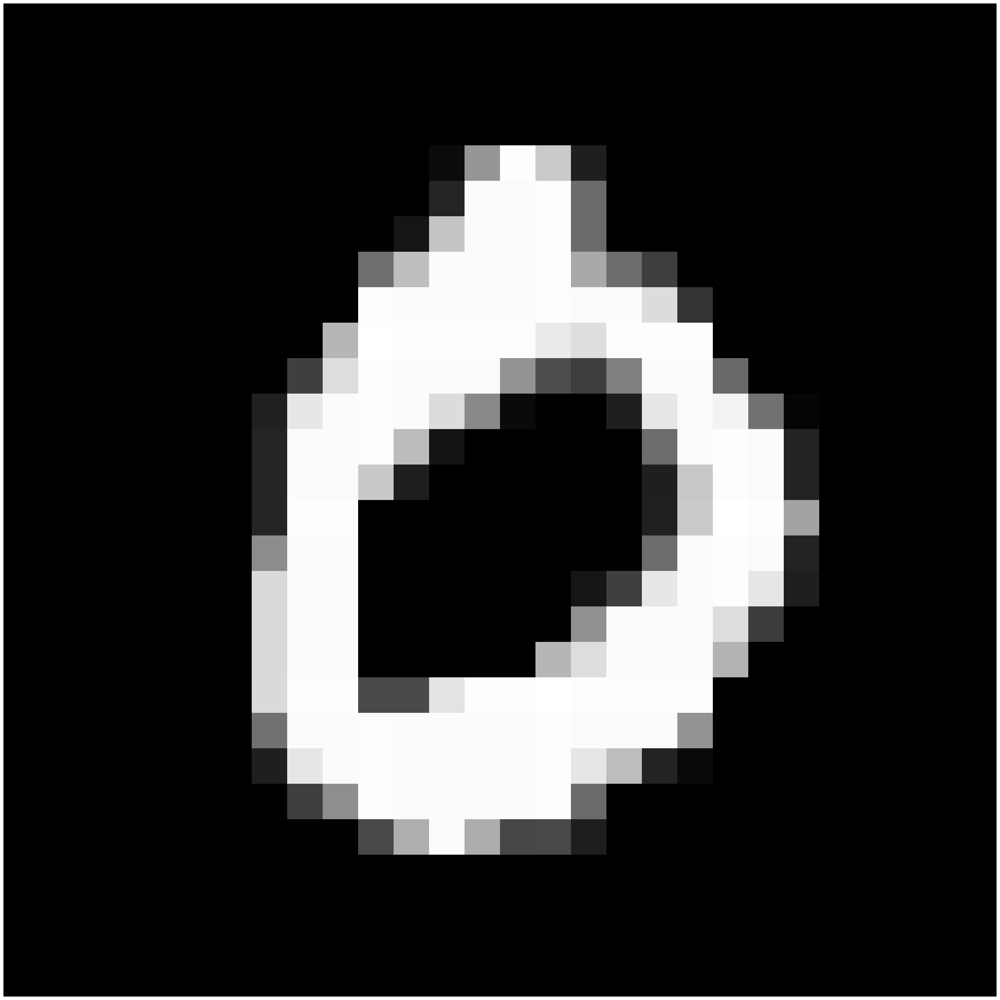

# AutoEncoders

## AutoEncoder

  Real zero
  
  Fake zero
  
   

  Real one
  
  Fake one
  
   

  Real two
  
  Fake two
  
   

  Real three
  
  Fake three
  
   

  Real four
  
  Fake four
  
   

  Real five
  
  Fake five
  
   

  Real six
  
  Fake six
  
   

  Real seven
  
  Fake seven
  
   

  Real eight
  
  Fake eight
  
   

  Real nine
  
  Fake nine
  
   

